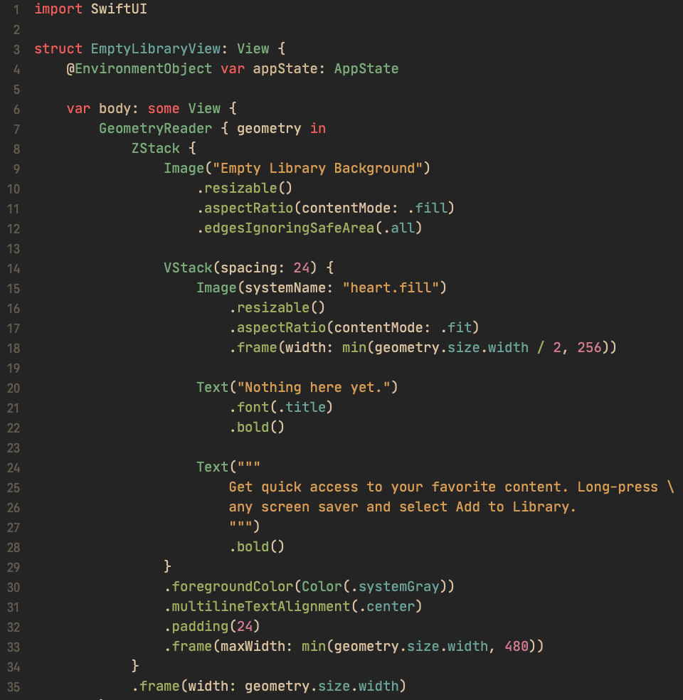

# Gruvbox Material theme for Xcode

Port of the [Gruvbox Material theme for VSCode](https://marketplace.visualstudio.com/items?itemName=sainnhe.gruvbox-material).



## How to install

Run this command in your terminal and restart Xcode:

```sh
mkdir -p ~/Library/Developer/Xcode/UserData/FontAndColorThemes && curl -fsSL https://raw.githubusercontent.com/WilsonGramer/gruvbox-material-xcode/main/Gruvbox%20Material.xccolortheme > ~/Library/Developer/Xcode/UserData/FontAndColorThemes/Gruvbox\ Material.xccolortheme
```
